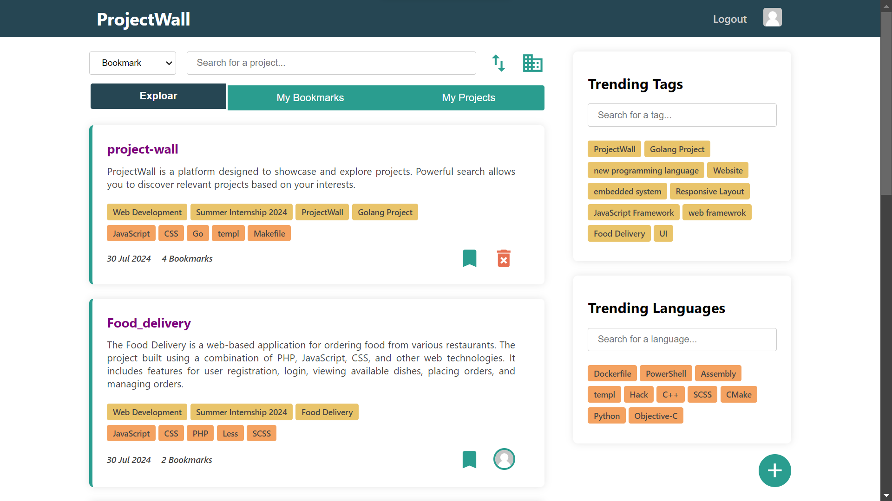
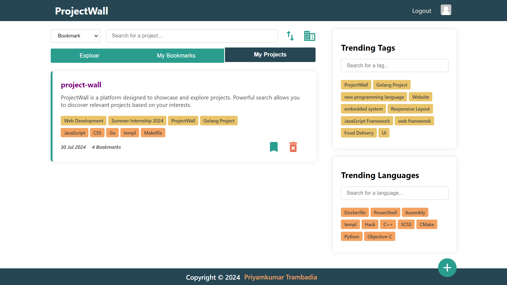
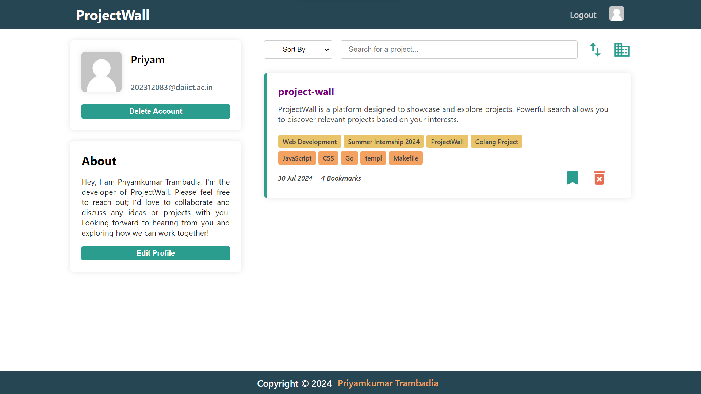
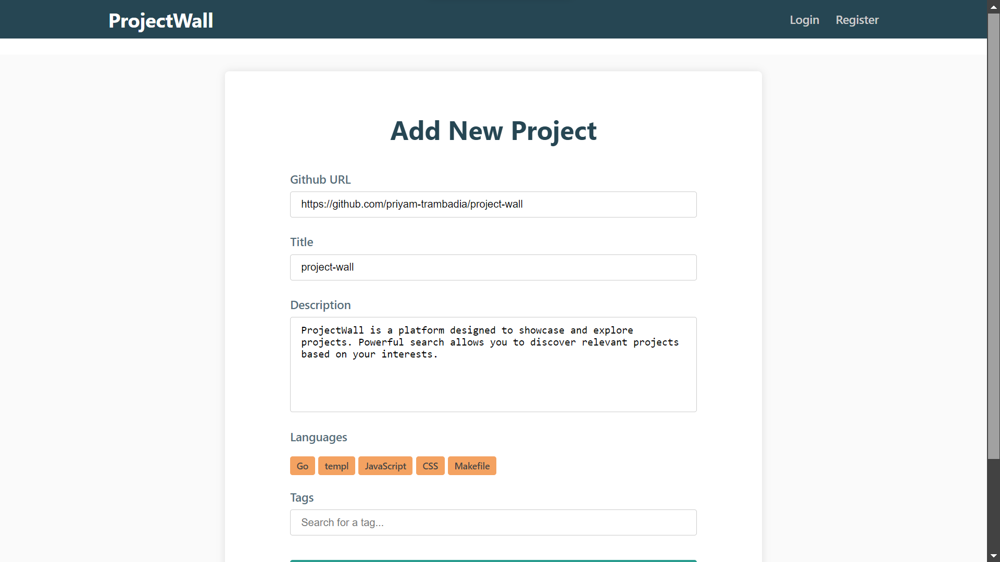

# ProjectWall

ProjectWall is a platform designed to showcase and explore projects. Powerful search allows you to discover relevant projects based on your interests.

Temporarily visit link [ProjectWall](https://priyam-trambadia.github.io/project-wall-redirect/)

## Prerequisites

> Tested on Ubuntu. Functionality on other systems may vary.

This project requires the following to be installed on your system:
* Go version 1.22.3 or higher
* PostgreSQL

* Go binaries at bin/vendor folder
  * [migrate](https://github.com/golang-migrate/migrate)
  * [templ](https://github.com/a-h/templ)

## Set Environment Variables
```
// postgresql
DATABASE_URL 

// set by user
PORT  
BASE_URL
ACCESS_TOKEN_SECRET 
ACCESS_TOKEN_EXPIRY
REFRESH_TOKEN_SECRET
REFRESH_TOKEN_EXPIRY
USER_ACTIVATION_TOKEN_SECRET
USER_ACTIVATION_TOKEN_EXPIRY
USER_PASSWORD_RESET_TOKEN_SECRET
USER_PASSWORD_RESET_TOKEN_EXPIRY

// gmail api access
GMAIL_ACCESS_TOKEN   
GMAIL_REFRESH_TOKEN
```

## Usage

```bash
# for database migration
make migration
```
``` bash
# for running website
make
```

## Screenshot



